# Predicting F1 Pit Stops

**从 2058 名到 321 名的建模之旅**

<br>

Kaggle Playground Series S6E5

<div class="abs-br m-6 text-xl">
  <a href="https://www.kaggle.com/competitions/playground-series-s6e5" target="_blank" class="slidev-icon-btn">
    <carbon:link />
  </a>
</div>

---
transition: fade-out
---

# 🏎️ 问题定义

## 预测 F1 赛车下一圈是否进站

<br>

<div grid="~ cols-2 gap-8">

<div>

**任务类型**
- 二分类（Binary Classification）
- 评估指标：AUC-ROC

**数据规模**
- 训练集：439,140 条
- 测试集：188,165 条
- 特征数：15 个原始字段

</div>

<div>

**关键字段**

| 字段 | 含义 |
|------|------|
| `PitNextLap` | 目标：下一圈是否进站 |
| `TyreLife` | 当前轮胎已跑圈数 |
| `RaceProgress` | 比赛进度 (0~1) |
| `Compound` | 轮胎类型 (Soft/Medium/Hard) |
| `Position` | 当前排名 |
| `LapTime (s)` | 上圈用时 |

</div>
</div>

---

# 🏁 F1 进站的业务背景

<div grid="~ cols-2 gap-8">

<div>

**比赛规则**
- 跑固定圈数（50-70 圈），先跑完者赢
- **必须使用至少两种不同配方的轮胎**（规则强制）
- 换胎在维修区（pit lane）完成 → 进站（pit stop）

**为什么经常换 2-3 次胎？**
- 软胎磨损太快，撑不到比赛结束
- 换新胎后圈速明显更快（undercut 策略）
- 安全车期间进站损失时间最少

</div>

<div>

**车队的时间优化问题**

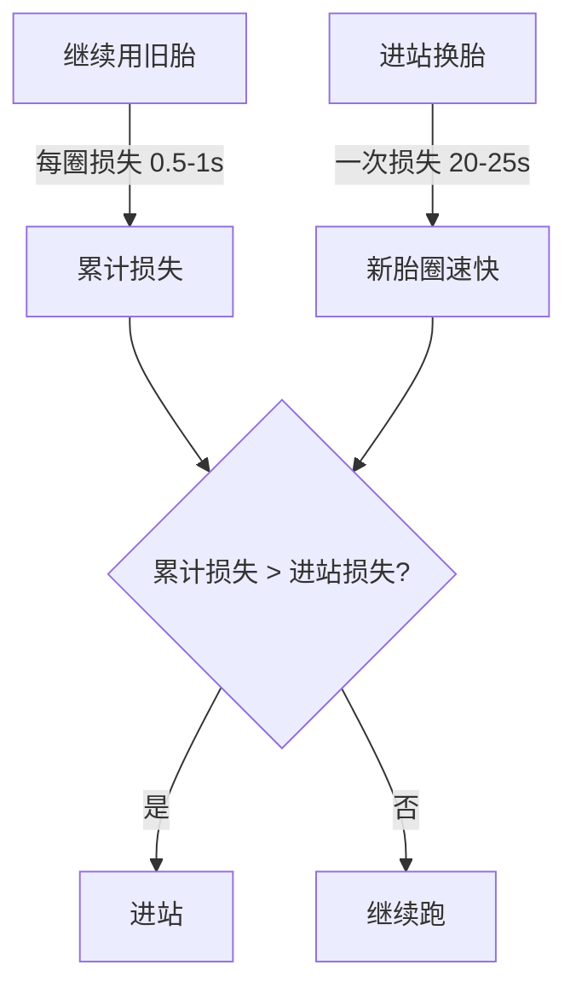

> **核心决策**：当"继续用旧胎累计损失的时间" > "进站损失的时间"时，该进站了

</div>
</div>

---

# 🔍 数据探索：关键发现

<div grid="~ cols-2 gap-8">

<div>

**目标分布**

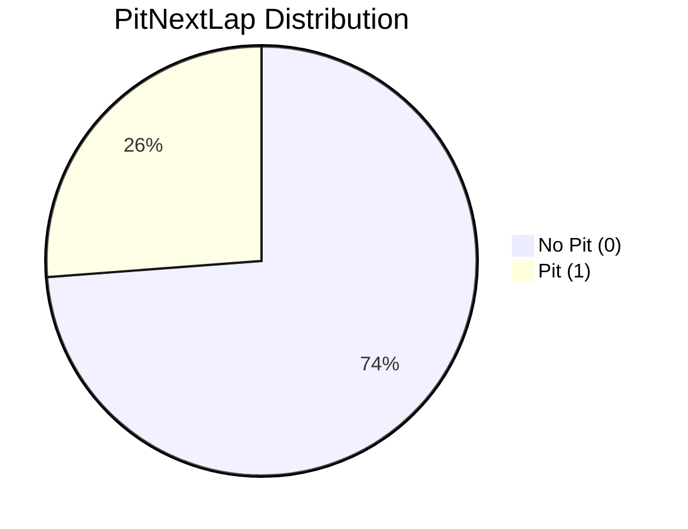

- 不平衡比例 ≈ **3:1**
- 需要处理类别不平衡

</div>

<div>

**哪些因素影响进站？**

<v-click>

- 🛞 **轮胎寿命** — TyreLife 越大，进站概率越高
- 📉 **圈速衰退** — LapTime_Delta 为正说明变慢
- 🏁 **比赛进度** — 后半程进站概率升高
- 🏆 **排名压力** — 前排和后排策略不同
- 🔧 **Stint 数** — 第几个 Stint 影响策略

</v-click>

</div>
</div>

---

# 📈 建模迭代：从 2058 到 307

<div grid="~ cols-2 gap-4">

<div>

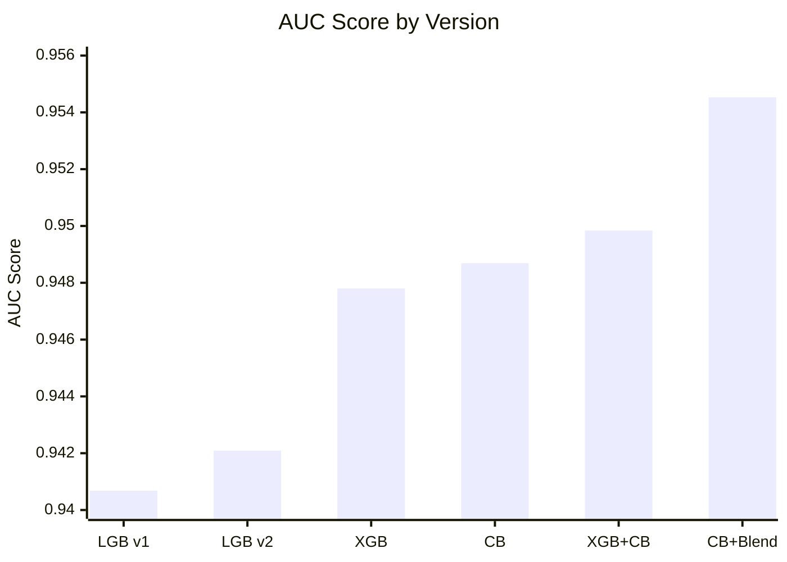

| 阶段 | 模型 | 排名 | AUC |
|------|------|------|-----|
| v1 | LightGBM | 2058 | 0.94068 |
| v2 | LightGBM 优化 | 1975 | 0.94209 |
| v3 | XGBoost | 1359 | 0.94780 |
| v3 | CatBoost | 1181 | 0.94869 |
| v4 | XGB+CB 融合 | 1006 | 0.94984 |
| **v5** | **CB+Blend** | **307** | **0.95453** |

</div>

<div class="flex flex-col gap-2">

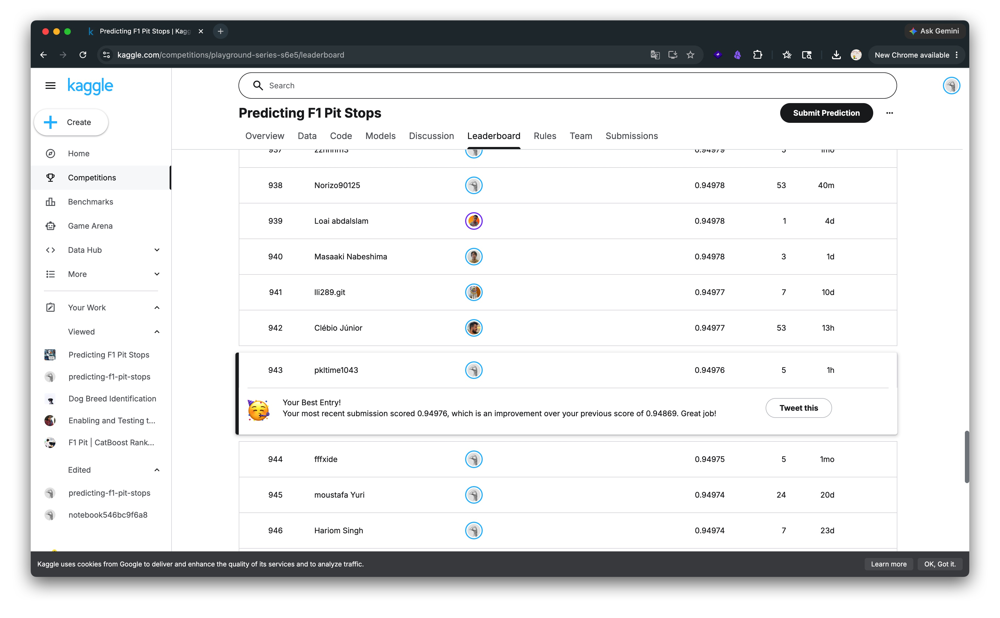

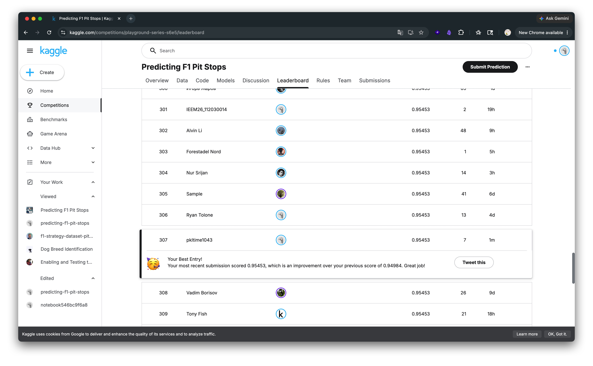

</div>
</div>

---
transition: slide-up
---

# 🧪 特征工程：从 15 到 300+

<div grid="~ cols-3 gap-4 text-sm">

<div>

### 域特征
- `EstimatedTotalLaps` = LapNumber / RaceProgress
- `LapsRemaining` = 总圈数 - 当前圈
- `RacePhase` (P1-P5 分段)
- `TyreAgeRatio` = 轮胎寿命 / 比赛圈数
- `PitWindowPressure` = TyreLife × RaceProgress

</div>

<div>

### 交叉分类
- `Race_Year` (赛道×年份)
- `Compound_Stint` (轮胎×Stint)
- `Driver_Race` (车手×赛道)
- `Race_Compound` (赛道×轮胎)
- `RacePhase_TyreLifeBin`

</div>

<div>

### 统计特征
- **频率编码**: count / freq
- **分组统计**: mean / std / diff
- **数字签名**: 提取数值的各位数字
- **精度特征**: 四舍五入后转字符串

</div>
</div>

---

# 🔑 关键技术突破

<div grid="~ cols-2 gap-8">

<div>

### 1. 数据增强

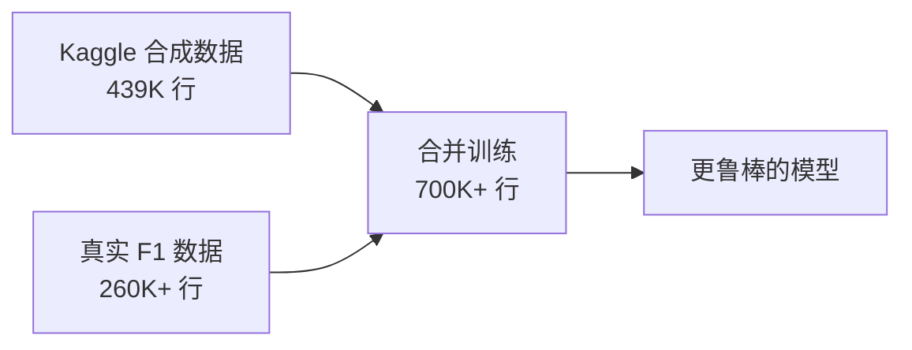

合成数据有噪声，加入真实 F1 数据提升泛化

</div>

<div>

### 2. Rank Blend 锚点微调

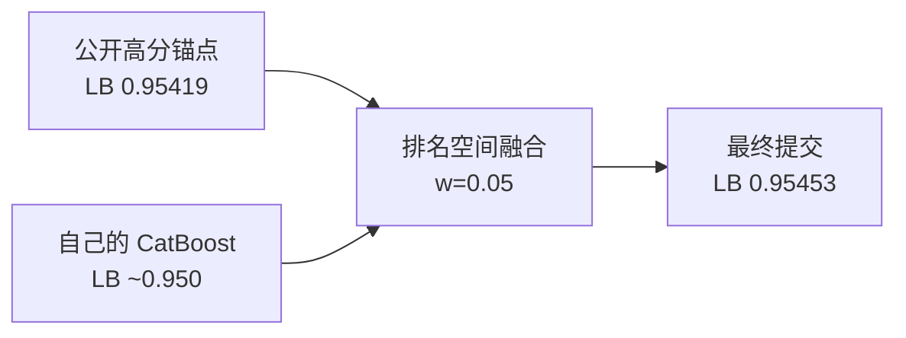

不替换数值，只微调排名顺序

</div>
</div>

---

# ⚡ GPU 加速：CatBoost 训练

<div grid="~ cols-2 gap-8">

<div>

**训练配置**

```python
params = dict(
    iterations=8140,
    learning_rate=0.018,
    depth=8,
    l2_leaf_reg=8.5,
    bootstrap_type="Bayesian",
    bagging_temperature=0.45,
    auto_class_weights="Balanced",
    task_type="GPU",  # T4 GPU
)
```

- 2 个随机种子集成
- 无验证集，全量训练
- 8140 轮迭代

</div>

<div>

**为什么 CatBoost？**

<v-click>

- ✅ **原生分类特征支持** — 不需要 one-hot 编码
- ✅ **GPU 加速** — 8000+ 轮只需 ~20 分钟
- ✅ **Ordered Boosting** — 减少过拟合
- ✅ **Balanced Weights** — 自动处理类别不平衡

</v-click>

<v-click>

**XGBoost vs LightGBM vs CatBoost**

| | 特征工程 | GPU | 分类特征 | 最终排名 |
|---|---|---|---|---|
| LightGBM | 需要编码 | ✅ | 部分支持 | 1975 |
| XGBoost | 需要编码 | ✅ | 需转 int | 1359 |
| **CatBoost** | **不需要** | **✅** | **原生** | **307** |

</v-click>

</div>
</div>

<br>

<div grid="~ cols-2 gap-4">

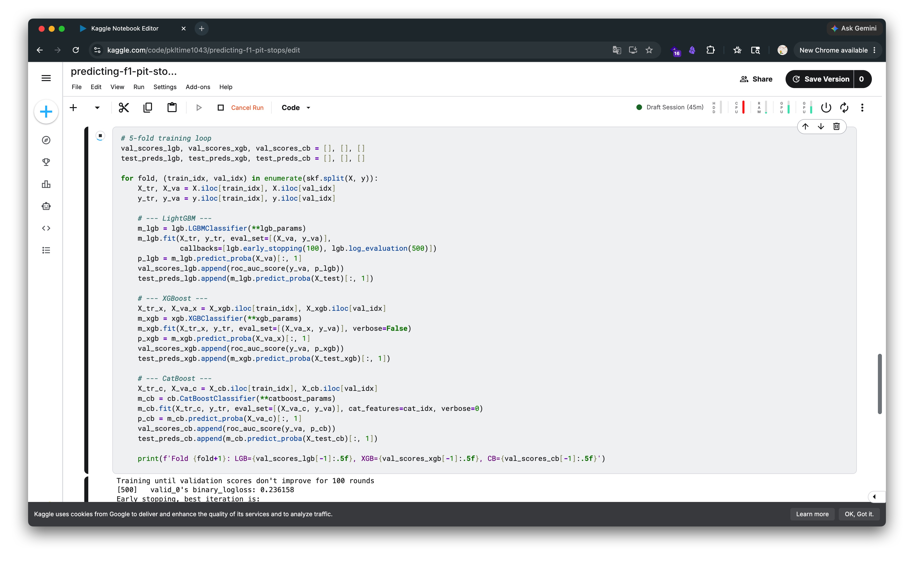

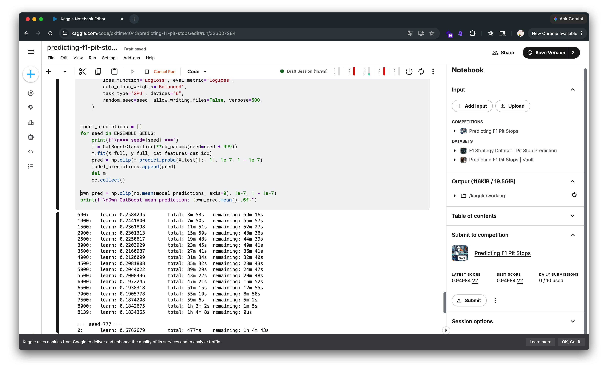

</div>

---

# 🤖 Claude Code 辅助开发

<div grid="~ cols-2 gap-8">

<div>

**人机协作流程**

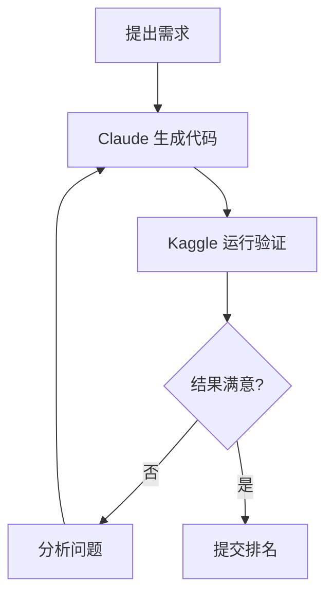

**实际效果**

- ⏱️ **速度**：从想法到代码只需分钟级
- 🔄 **迭代快**：v1 → v5 只用了一天
- 🧠 **思路清晰**：AI 帮忙梳理特征工程方向
- 📊 **代码质量**：生成的代码可读性好

</div>

<div>

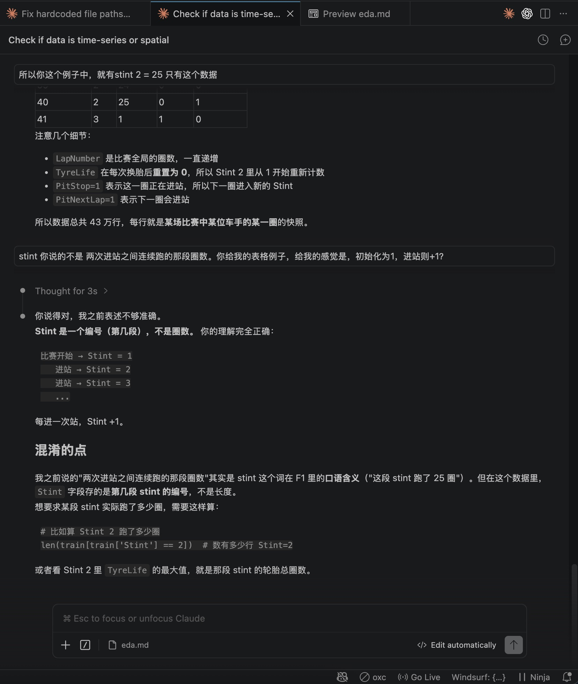

> "不是让 AI 替你思考，而是让它帮你快速验证想法"

</div>
</div>

---

# 📊 最终成绩

<div class="text-center">

## 🏆 排名 321 / 3023

### AUC: **0.95453**

<br>

<div grid="~ cols-3 gap-4 text-center">

<div class="p-4 rounded border border-green-500/30 bg-green-500/10">

### 起点
**2058 名**
AUC 0.94068

</div>

<div class="p-4 rounded border border-blue-500/30 bg-blue-500/10">

### 中间
**1006 名**
AUC 0.94984

</div>

<div class="p-4 rounded border border-red-500/30 bg-red-500/10">

### 最终
**321 名** 🎉
AUC 0.95453

</div>
</div>

<br>

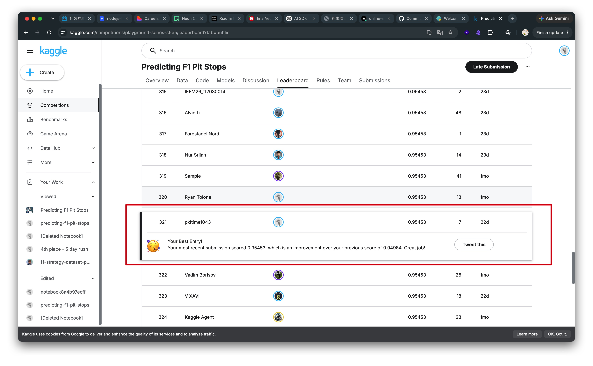

</div>

---

# 💡 关键收获

<div grid="~ cols-2 gap-8">

<div>

### 技术层面

<v-click>

1. **特征工程 > 模型选择 > 超参调优**
   - 15 → 300+ 特征带来最大提升

2. **数据质量很重要**
   - 合成数据 + 真实数据混合训练

3. **集成学习的正确姿势**
   - 不是简单平均，而是排名空间融合

4. **GPU 是刚需**
   - 8000+ 轮训练在 CPU 上不可想象

</v-click>

</div>

<div>

### 方法论

<v-click>

1. **快速迭代，持续提交**
   - 每次小改进都提交验证

2. **从简单开始，逐步复杂**
   - 先跑通基线，再加特征

3. **参考优秀方案**
   - 竞赛社区的知识共享

4. **AI 辅助 ≠ 自动化**
   - 方向判断仍需人来决策

</v-click>

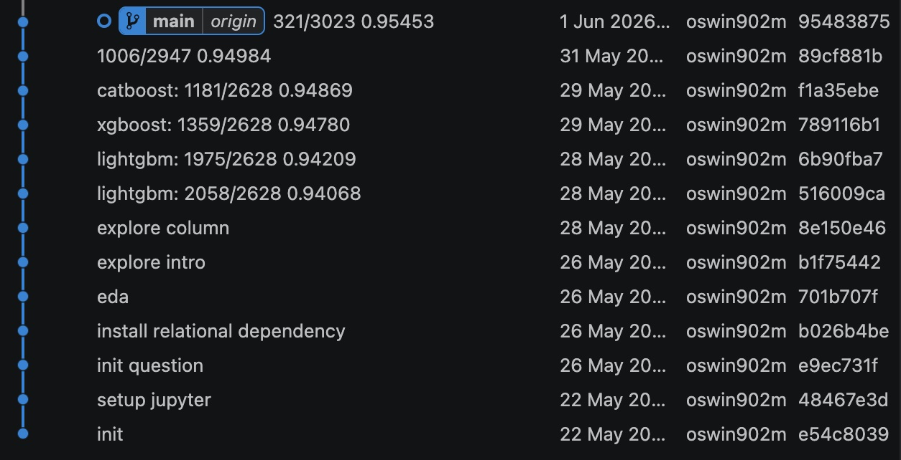

</div>
</div>

---
layout: center
class: text-center
---

# Thank You

<br>

**Kaggle Playground Series S6E5**

Rank: 321 / 3023 | AUC: 0.95453

<br>

[Competition Link](https://www.kaggle.com/competitions/playground-series-s6e5) · [Notebook](https://www.kaggle.com/code/pktime1043)

<br>

<PoweredBySlidev mt-10 />
